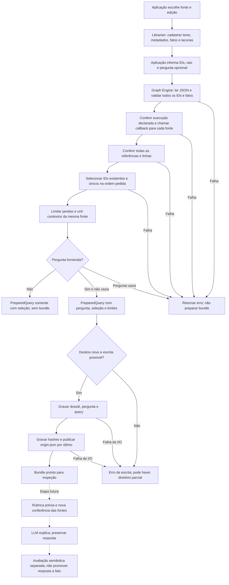
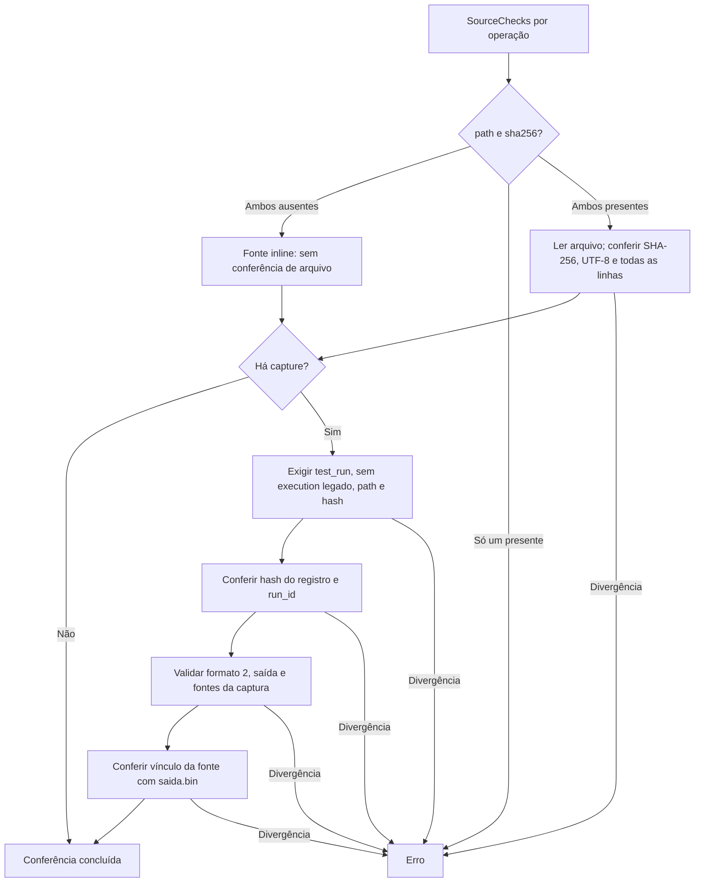

# Referência técnica: fluxo formal de dossiês 0.1

Este documento preserva regras da API de cadastro manual/PreparedQuery. Não é
um segundo roteiro operacional. Para a trilha código → Ollama, comece pelo
[TESTME](../../TESTME.md) do Librarian.

## Regras de cada passagem

| Etapa | Regra implementada |
| --- | --- |
| Cadastro | `Source` e `Evidence` são contratos públicos; construir/desserializar não valida. Fatos vêm da aplicação. ID do dossiê e metadados são opcionais. |
| Identidade | IDs de fonte e fato não podem estar vazios nem duplicados em seus respectivos conjuntos. Afirmação e `source_id` não vazios; linha maior que zero. IDs não são normalizados. |
| Validação integral | Fontes e fatos fora da seleção também são conferidos. O primeiro erro interrompe a preparação. JSON deve corresponder aos tipos; campos extras não são uma garantia de validação. |
| Referência | `source_id` deve existir e linha deve estar dentro do texto cadastrado, contando a partir de 1. Não verifica sustentação semântica. |
| Callback | A aplicação define como conferir armazenamento. Um callback que retorna sucesso sem ler arquivos não comprova bytes. `prepare_query` chama o callback uma vez por fonte e reutiliza seu resultado na seleção. |
| Seleção | Ao menos um ID, todos existentes e sem repetição; preserva ordem pedida. Não há busca semântica pela pergunta. |
| Contexto | Raio zero é permitido; limites são saturados ao texto. Janelas sobrepostas/adjacentes se unem apenas na mesma fonte. Podem cortar funções ou frases. IDs `CTX` são locais à exportação. |
| Forma da query | Uma ficha: `evidence.source.context`. Várias: `evidence.selections` e `evidence.contexts`. Preserva todas as lacunas declaradas do dossiê, sem filtrar relevância. |
| Pergunta | Ausente permite seleção isolada; vazia é rejeitada; bundle exige pergunta. Instruções pedem citação, separação de observações/hipóteses e tratamento das fontes como dados. Não garantem obediência de um LLM. |
| Exportação | Destino deve ser novo. Preserva dossiê/pergunta recebidos e query serializada; registra seleção, hashes, timestamp e limites. `origin.json` é publicado por último. Sem rollback, snapshot atômico ou nova conferência de fontes na escrita. |

## Callback de arquivos e capturas

- Arquivos relativos são resolvidos pelo diretório atual. O exemplo `export`
  exige path/hash, embora a biblioteca permita fontes inline.
- Captura exige `schema_version=2`, run_id não vazio, argv com executável,
  cwd absoluto, datas não vazias e ambiente não vazio. Datas/ambiente recebem
  conferência básica, sem autenticação.
- Resultado aceita `exited` com código não negativo, `signaled` com sinal positivo
  e código nulo, ou `start_failed` com erro não vazio e código nulo. Campos
  incompatíveis são rejeitados. Código diferente de zero não invalida uma captura
  consistente e não significa teste aprovado.
- Saída exige `saida.bin`, `stdout+stderr`, tamanho e SHA-256 correspondentes.
  Hashes de captura têm 64 caracteres hexadecimais minúsculos.
- Fontes capturadas exigem caminho consistente com cwd e hash anterior válido.
  `equal`/`different` devem concordar com hashes anteriores/posteriores e arquivo
  atual; `unavailable` exige erro posterior sem hash posterior e não confere o
  arquivo atual. Indisponibilidade histórica não fica comprovada.
- O vínculo de captura confere também caminho efetivo e hash da saída. O cache
  por caminho/hash/run_id evita repetir a captura, mantendo o vínculo individual
  de cada fonte. Use um novo `SourceChecks` em cada operação.

## Caminhos opcionais e compatibilidade

| Recurso | Alcance |
| --- | --- |
| `execution` legado | Exige `kind=test_run`; compara comando, início, fim e código com campos únicos no cabeçalho até a primeira linha vazia. ID e semântica dos horários não são autenticados. |
| Metadados exportados | Código Rust não recebe alegação `executed`. Conferência de captura substitui os campos legados de execução na seleção. Autoria, kind e git_commit continuam declarações. |
| Parecer `validate_review` | Confere fato existente, afirmação original, referência e trecho exato. Não aprova veredito, justificativa ou afirmação avaliada. Não é etapa automática de `prepare_query`. |
| Core legado `EvidenceBundle` | Uma fonte; valida identidade/caminho, fatos não vazios, referências, seleção e raio positivo. Difere do raio zero permitido no Graph Engine. `to_query` não chama validação automaticamente. |
| Helpers de baixo nível | `query_json`, `bundle::write` e helpers de seleção não substituem validação integral. Use `prepare_query` + `write_bundle` como caminho recomendado. |
| Métricas | `BIBLIOTECARIO_METRICS=1` habilita contagens instrumentadas; emissão depende do consumidor. São chamadas/bytes lógicos, não I/O físico, benchmark ou avaliação semântica. |

O adapter do renderer acrescenta cadastro por edição Git e recálculo de amostras;
isso não é uma capacidade automática do Graph Engine. Não há banco, extração de
fatos, autenticação de execução ou biblioteca LLM neste fluxo. Uma referência
válida não prova a afirmação; hashes não autenticam execução.
